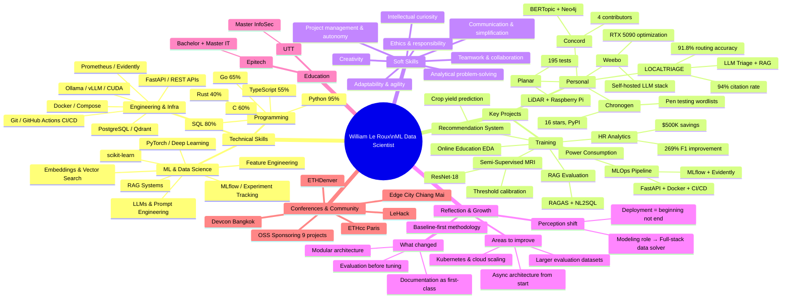

# William Le Roux — ML Data Scientist Portfolio Mind Map

```mermaid
mindmap
  root((William Le Roux\nML Data Scientist))
    Technical Skills
      Programming
        Python 95%
        Go 65%
        C 60%
        Rust 40%
        TypeScript 55%
        SQL 80%
      ML & Data Science
        scikit-learn
        PyTorch / Deep Learning
        LLMs & Prompt Engineering
        RAG Systems
        MLflow / Experiment Tracking
        Feature Engineering
        Embeddings & Vector Search
      Engineering & Infra
        Docker / Compose
        FastAPI / REST APIs
        PostgreSQL / Qdrant
        Git / GitHub Actions CI/CD
        Ollama / vLLM / CUDA
        Prometheus / Evidently
    Key Projects
      Personal
        LOCALTRIAGE
          LLM Triage + RAG
          91.8% routing accuracy
          94% citation rate
        Planar
          LiDAR + Raspberry Pi
          195 tests
        Chronogen
          Pen testing wordlists
          16 stars, PyPI
        Concord
          BERTopic + Neo4j
          4 contributors
        Weebo
          Self-hosted LLM stack
          RTX 5090 optimization
      Training
        MLOps Pipeline
          MLflow + Evidently
          FastAPI + Docker + CI/CD
        HR Analytics
          269% F1 improvement
          $500K savings
        RAG Evaluation
          RAGAS + NL2SQL
        Semi-Supervised MRI
          ResNet-18
          Threshold calibration
        Recommendation System
          Crop yield prediction
        Power Consumption
        Online Education EDA
    Soft Skills
      Analytical problem-solving
      Intellectual curiosity
      Communication & simplification
      Teamwork & collaboration
      Adaptability & agility
      Project management & autonomy
      Creativity
      Ethics & responsibility
    Reflection & Growth
      What changed
        Baseline-first methodology
        Evaluation before tuning
        Modular architecture
        Documentation as first-class
      Perception shift
        Modeling role → Full-stack data solver
        Deployment = beginning not end
      Areas to improve
        Larger evaluation datasets
        Async architecture from start
        Kubernetes & cloud scaling
    Education
      Epitech
        Bachelor + Master IT
      UTT
        Master InfoSec
    Conferences & Community
      ETHDenver
      ETHcc Paris
      Devcon Bangkok
      LeHack
      Edge City Chiang Mai
      OSS Sponsoring 9 projects
```