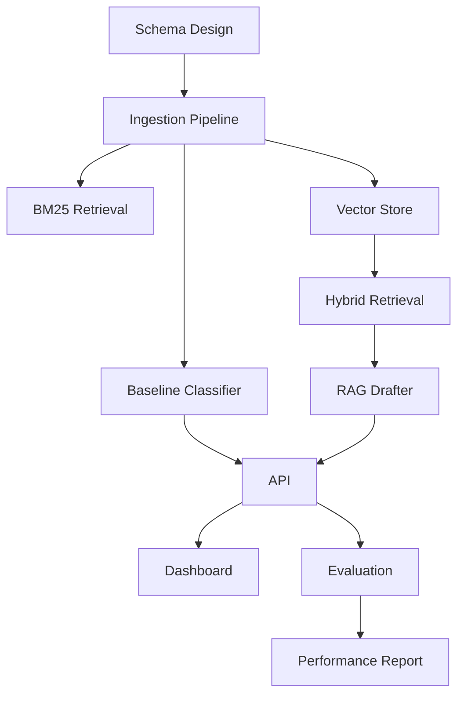

# LOCALTRIAGE - Project Plan

## Project Overview

**Project Name:** Local LLM Customer Support Triage + Response Drafting + Analytics Platform  
**Duration:** 3 weeks (15 working days)  
**Start Date:** TBD  
**Owner:** [Project Lead]

---

## Milestones & Timeline

### Week 1: Foundation & Data Pipeline

| Day | Tasks | Deliverables |
|-----|-------|--------------|
| 1-2 | Project setup, documentation | BRD, CONTEXT.md, architecture diagram |
| 2-3 | Database schema, ingestion pipeline | schema.sql, ingest.py |
| 3-4 | Baseline routing (TF-IDF + LogReg) | baseline_classifier.py |
| 4-5 | Baseline retrieval (BM25/FTS) | baseline_bm25.py |

**Milestone 1:** Baseline system operational with measurable metrics

### Week 2: LLM Integration & RAG

| Day | Tasks | Deliverables |
|-----|-------|--------------|
| 6-7 | Vector store setup, embedding pipeline | vector_search.py |
| 7-8 | Hybrid retrieval implementation | Hybrid retriever with RRF |
| 8-9 | LLM integration, prompt engineering | drafter.py |
| 9-10 | RAG pipeline with citations | Full drafting capability |

**Milestone 2:** RAG drafting pipeline operational

### Week 3: Evaluation, UI & Deployment

| Day | Tasks | Deliverables |
|-----|-------|--------------|
| 11-12 | Evaluation harness, test suite | eval_harness.py, test data |
| 12-13 | API development | api.py, FastAPI endpoints |
| 13-14 | Streamlit dashboard | app.py |
| 14-15 | Docker deployment, documentation | docker-compose.yml, README |

**Milestone 3:** Production-ready system with full documentation

---

## Dependencies



### Critical Path
1. Schema → Ingestion → Vector Store → Hybrid Retrieval → RAG Drafter → API
2. Parallel: Baseline systems can be developed alongside LLM integration

### External Dependencies
- PostgreSQL 15+ database
- CUDA-capable GPU (optional, for faster inference)
- Hugging Face model access
- Sample ticket/KB data for testing

---

## Resource Requirements

### Compute Resources
| Resource | Development | Production |
|----------|-------------|------------|
| CPU | 8+ cores | 16+ cores |
| RAM | 32GB | 64GB |
| GPU | Optional | 1x RTX 4090 / A100 |
| Storage | 100GB | 500GB |

### Human Resources
| Role | Allocation | Responsibilities |
|------|------------|------------------|
| ML Engineer | 100% | RAG, embeddings, evaluation |
| Backend Developer | 50% | API, database, deployment |
| DevOps | 25% | Docker, infrastructure |

---

## Risk Register Summary

| Risk | Probability | Impact | Mitigation |
|------|-------------|--------|------------|
| Model doesn't fit in VRAM | Medium | High | Quantization, CPU fallback |
| Latency exceeds targets | Medium | Medium | Caching, model optimization |
| Retrieval quality insufficient | Low | High | Hybrid search, reranking |
| Data quality issues | Medium | Medium | Validation pipeline, cleaning |

See [risk_register.md](risk_register.md) for detailed risk analysis.

---

## Success Criteria

### Quantitative
- [ ] Routing accuracy ≥ 90%
- [ ] Retrieval Recall@5 ≥ 80%
- [ ] Draft quality rating ≥ 4.0/5
- [ ] End-to-end latency < 5s (P95)

### Qualitative
- [ ] Agent feedback shows drafts reduce response time
- [ ] Citations are accurate and helpful
- [ ] System is stable under load

---

## Weekly Status Template

```markdown
## Week [N] Status Report

**Period:** [Start Date] - [End Date]

### Accomplishments
- 

### In Progress
- 

### Blockers
- 

### Next Week
- 

### Metrics
| Metric | Target | Current |
|--------|--------|---------|
| Routing Accuracy | 90% | % |
| Retrieval Recall@5 | 80% | % |
| Draft Rating | 4.0 | |
| P95 Latency | 5s | s |
```

---

## Communication Plan

| Meeting | Frequency | Participants | Purpose |
|---------|-----------|--------------|---------|
| Daily Standup | Daily | Dev Team | Progress, blockers |
| Sprint Review | Weekly | All Stakeholders | Demo, feedback |
| Technical Review | Bi-weekly | Tech Leads | Architecture decisions |

---

## Change Control

All significant changes must be documented:
1. Create issue/ticket describing the change
2. Get approval from project lead
3. Update relevant documentation
4. Communicate to stakeholders

---

*Last Updated: [Date]*
